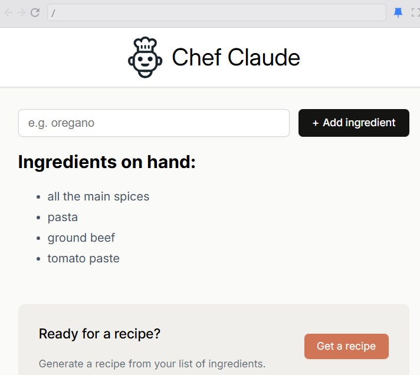

#   🍽️ Chef Claude – AI-Powered Recipe Helper  

 > A simple and fun React app that helps users generate recipes based on the ingredients they already have.
 

---

## 🪞 Overview  
Chef Claude is a lightweight React application that allows users to add ingredients and instantly receive a suggested recipe.  
It solves the classic question: *"What can I cook with what I have?"*  

This project is ideal for both beginners learning React and users wanting quick meal inspiration.  
The app stands out with its clean UI, dynamic ingredient list, and the charming personality of “Chef Claude.” 
  

---

## 🚀 Features  
✨ Key things your app can do:  

- 📝 Add ingredients through a simple form  
- 🧺 Display a live updating list of ingredients  
- 🍝 Generate a recipe when enough ingredients are provided  
- 🔄 Toggle recipe visibility  
- 📱 Fully responsive and clean interface  

---

## 🧱 Tech Stack  
| Technology | Purpose |
|-----------|---------|
| **React (Vite)** | App structure & component management |
| **JavaScript (ES6+)** | Logic, state handling |
| **CSS3** | Styling & layout |
| **Component-Based Architecture** | Reusability & clean structure |

---

## 📚 What We Have Studied  

Here are the key JavaScript concepts or tools covered while building this project 🧩   

> Concepts practiced include:  
> ---- React `useState`  
> Passing props between components  
> DOM rendering through JSX  
> Mapping arrays to UI lists  
> Conditional rendering (`&&` logic)  
> Form submissions in React  
> Organizing components cleanly  
> Building simple dynamic UIs  

## 🌿 Lessons Learned  
Reflect briefly on your takeaways:  

- Improved understanding of state management  
- How to immutably update arrays in React  
- Breaking UI into reusable components  
- Handling user inputs effectively  
- Using conditional UI sections to enhance interactivity  
- Creating a beginner-friendly and structured mini React app

---


## ▶️ How to Run the Project

```bash
npm install
npm run dev

## 🖼️ Screenshots / Demo  

  

🔗 **Live Demo:** [https://your-demo-link.vercel.app](https://your-demo-link.vercel.app)  

---

## 💫 Author  
👩‍💻 **Created by [Aliya](https://github.com/aliyasyeddd)**  
> _“Build. Break. Learn. Repeat.”_ 🌸  

---
